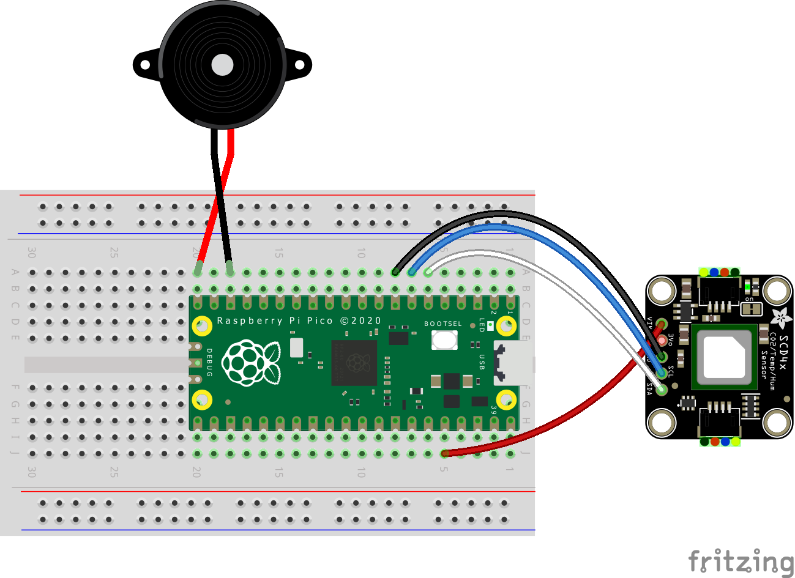

# Carbon dioxide (CO<sub>2</sub>) alarm

## Table of Contents

- [Carbon dioxide (CO<sub>2</sub>) alarm](#carbon-dioxide-cosub2sub-alarm)
  - [Table of Contents](#table-of-contents)
  - [Hardware Requirements](#hardware-requirements)
  - [Assembly and wiring](#assembly-and-wiring)
    - [LiPo SHIM for Pico](#lipo-shim-for-pico)
    - [Buzzer](#buzzer)
    - [SCD41 CO2 Sensor](#scd41-co2-sensor)
    - [Diagram](#diagram)
  - [Software and installation](#software-and-installation)
    - [Prerequisites](#prerequisites)
    - [Build and installation](#build-and-installation)

## Hardware Requirements

- 1x [Raspberry Pi Pico](https://www.raspberrypi.com/products/raspberry-pi-pico/)
- 1x [SCD41 CO2 Sensor by Pimoroni](https://shop.pimoroni.com/products/scd41-co2-sensor-breakout?variant=39652270833747)
- 1x [Buzzer 5V by Adafruit](https://www.adafruit.com/product/1536)
  - NOTE: can be substituted with regular [piezo buzzer](https://www.adafruit.com/product/160)
  - OBSERVATION: this seemed louder than a regular piezo while playing around with them
- (Optional) 1x [LiPo SHIM for Pico by Pimoroni](https://shop.pimoroni.com/products/pico-lipo-shim?variant=32369543086163)
  - For wired operation this is not required
  - NOTICE: installing headers onto the Pico is recommended
  - NOTE: Pimoroni sells these built into their own Pico models with [4MB](https://shop.pimoroni.com/products/pimoroni-pico-lipo?variant=39386149093459) and [16MB](https://shop.pimoroni.com/products/pimoroni-pico-lipo?variant=39335427080275) of flash memory.
- (Optional) 1x 3.7V rechargeable battery
  - [6700mAh lithium ion battery](https://shop.pimoroni.com/products/high-capacity-lithium-ion-battery-pack?variant=32012684591187)
- Solder, soldering iron and wires to conenct everything together
- (Optional) Breadboard for testing
- (Optional) Headers for the Pico and the CO2 sensor make testing easy

## Assembly and wiring

- [Raspberry Pi Pico documentation and pinout](https://www.raspberrypi.com/documentation/microcontrollers/raspberry-pi-pico.html)
- [SCD41 CO2 Sensor by Pimoroni schematic](https://cdn.shopify.com/s/files/1/0174/1800/files/scd41_breakout_schematic.pdf)
- [LiPo SHIM for Pico schematic](https://cdn.shopify.com/s/files/1/0174/1800/files/lipo_shim_for_pico_schematic.pdf)

### LiPo SHIM for Pico

> [You'll need to solder the SHIM to the back of your Pico, with the power button at the same end as the USB port. The text on the SHIM and the pin labels on the back of the Pico should be facing each other.](https://shop.pimoroni.com/products/pico-lipo-shim?variant=32369543086163)

### Buzzer

- Positive pin -> GPIO 15 (pin 20)
- Negative pin -> GND (pin 18)
  - NOTE: any GND pin is okay

### SCD41 CO2 Sensor

- 3-5V -> 3V3 (pin 36)
- SDA -> GPIO 4 (pin 6)
- SCL -> GPIO 5 (pin 7)
- GND -> GND (pin 8)
  - NOTE: any GND pin is okay

### Diagram

<figure>
    
    <figcaption>Wiring diagram.</figcaption>
</figure>

- Sensor shown on the diagram is made by Adafruit and is only a reference. (Couldn't find a model made by Pimoroni.)
  - [Adafruit SCD-41](https://www.adafruit.com/product/5190)

## Software and installation

### Prerequisites

- Setup the latest verison the [Raspberry Pi Pico SDK](https://github.com/raspberrypi/pico-sdk), [Pico examples](https://github.com/raspberrypi/pico-examples) and [Pico extras](https://github.com/raspberrypi/pico-extras).
    - [Official guide by the Raspberry Pi Foundation.](https://datasheets.raspberrypi.com/pico/getting-started-with-pico.pdf)
- Setup the latest verison the [Pimoroni Pico Libraries](https://github.com/pimoroni/pimoroni-pico).
    - [Installation guide by Pimoroni.](https://github.com/pimoroni/pimoroni-pico/blob/main/setting-up-the-pico-sdk.md)

### Build and installation

**1. Clone the repository.**

``` shell
git clone https://github.com/KollerFerenc/CO2Alarm-CPP
```

**2. Buzzer selection**

In CO2Alarm-CPP -> src -> main.cpp uncomment which type of buzzer you are using.

*A. Regular piezo buzzer*

```cpp
// NOTICE: buzzer selection!

// Use this with the 5V Buzzer by Adafruit (https://www.adafruit.com/product/1536)
// #define BUZZER_TYPE_BUZZER3V5V

// Use this with any regular piezo buzzer
#define BUZZER_TYPE_PIEZO
```

*B. [Buzzer 5V by Adafruit](https://www.adafruit.com/product/1536)*

```cpp
// NOTICE: buzzer selection!

// Use this with the 5V Buzzer by Adafruit (https://www.adafruit.com/product/1536)
#define BUZZER_TYPE_BUZZER3V5V

// Use this with any regular piezo buzzer
// #define BUZZER_TYPE_PIEZO
```

Save the file.

**3. (Optional) Adjust the values in the Configurables section to match your setup.**

Save the modified file.

**4. Create build directory**

``` shell
cd CO2Alarm-CPP
mkdir build
```

**5. Build project**

``` shell
cd build
cmake ..
make
```

**6. Copy the uf2 file to the Pico**

- Binary location: CO2Alarm -> build -> src -> co2alarm.uf2
- Put the Pico into bootloader mode and copy the uf2 file to it.
